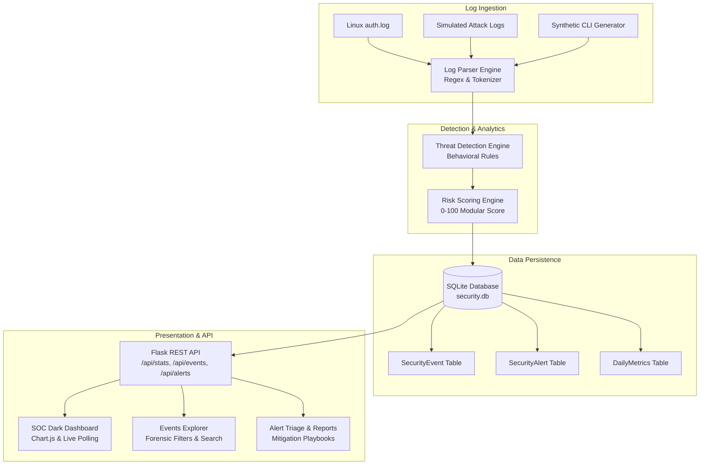

# SentinelSOC — Real-Time Security Operations Center

[](https://python.org)
[](https://flask.palletsprojects.com/)
[](https://sqlite.org)
[](https://getbootstrap.com)
[](https://chartjs.org)
[](LICENSE)

> A lightweight, production-grade Security Operations Center (SOC) dashboard that ingests server and authentication logs, analyzes adversarial patterns in real-time, computes explainable risk scores (0–100 scale), and triages incidents through an intuitive cyber-dark web dashboard.

---

## Table of Contents
- [Project Overview](#project-overview)
- [Problem Statement](#problem-statement)
- [Architecture](#architecture)
- [Key Features](#key-features)
- [Threat Detection Methodology](#threat-detection-methodology)
- [Risk Scoring Engine](#risk-scoring-engine)
- [Technology Stack](#technology-stack)
- [Project Structure](#project-structure)
- [Installation & Setup (Windows)](#installation--setup-windows)
- [Usage & Synthetic Threat Generation](#usage--synthetic-threat-generation)
- [REST API Reference](#rest-api-reference)
- [Testing & Quality Assurance](#testing--quality-assurance)
- [Security Considerations & Hardening](#security-considerations--hardening)
- [Screenshots & UI Showcase](#screenshots--ui-showcase)
- [Future Improvements](#future-improvements)
- [Suggested Repository Metadata](#suggested-repository-metadata)

---

## Project Overview

**SentinelSOC** is an automated, real-time Security Operations Center telemetry platform designed to bridge the gap between complex SIEM solutions and local security monitoring. It parses raw system authentication logs (`auth.log`), evaluates heuristic rule triggers, attributes attack vectors to adversary IPs, stores correlated events and alerts in SQLite via SQLAlchemy, and provides security analysts with interactive visualizations, incident playbooks, and continuous 5-second polling.

---

## Problem Statement

Modern enterprise infrastructure generates massive volumes of disparate authentication logs. Identifying active attacks (such as brute force, password spraying, account enumeration, and compromised credential usage) manually is slow and error-prone. SentinelSOC automates log correlation, risk ranking, and forensic analysis into a responsive, unified platform that allows immediate incident containment.

---

## Architecture

SentinelSOC uses a modular pipeline separating ingestion, parsing, heuristic threat correlation, risk scoring, persistence, and presentation.



---

## Key Features

- **Multi-Vector Threat Detection**: Identifies brute force, password spraying, successful login after multiple failures, user enumeration, privilege escalation, and unusual off-hours logins.
- **Modular Risk Scoring (0–100)**: Transparent risk calculation taking into account attempt volume, velocity, targeted user criticality, and post-crack access.
- **Cyber-Dark SOC UI**: Professional dashboard with neon accents, live polling status, and forensic JetBrains Mono typography.
- **Visual Analytics with Chart.js**:
  - Event Frequency Over Time (24h hourly timeline)
  - Threat Pattern Distribution (doughnut chart)
  - Severity Breakdown (horizontal/vertical bar chart)
  - Top Suspicious IPs (risk-ranked bar chart)
- **Advanced Events Explorer**: Search by IP, username, severity, threat vector, or date range with custom sorting and pagination.
- **Incident Playbooks & Remediation**: Every alert contains actionable mitigation guidance (e.g. firewall blocking, account password reset, token revocation).
- **Synthetic Log Generator**: Includes `generate_logs.py` to simulate realistic benign and adversarial traffic safely.
- **Complete REST API**: Endpoints for stats, events, alerts, distributions, and on-demand threat simulation.

---

## Threat Detection Methodology

SentinelSOC evaluates parsed log streams against six rule patterns:

| Rule | Threat Pattern | Detection Logic | Default Severity |
|---|---|---|---|
| **Rule A** | **Brute Force** | $\ge 5$ failed login attempts from the same IP within 5 minutes | `HIGH` (Scales to `CRITICAL` if $\ge 10$) |
| **Rule B** | **Password Spraying** | Failed logins targeting $\ge 3$ distinct accounts from a single IP within 10 minutes | `MEDIUM` / `HIGH` |
| **Rule C** | **Login After Failures** | A successful login immediately following $\ge 3$ failed attempts from the same IP | `HIGH` / `CRITICAL` |
| **Rule D** | **Account Enumeration** | $\ge 4$ invalid username probes (`INVALID_USER`) from the same IP within 15 minutes | `MEDIUM` |
| **Rule E** | **Suspicious Access** | $\ge 3$ repeated `ACCESS_DENIED`, `PRIVILEGE_ESCALATION`, or traversal attempts within 10 minutes | `MEDIUM` / `HIGH` |
| **Rule F** | **Unusual Login Time** | Successful authentication outside configured normal business hours (08:00 – 20:00) | `LOW` / `MEDIUM` |

---

## Risk Scoring Engine

Every incident is evaluated through a modular scoring formula mapped to a 0–100 scale:

$$\text{Risk Score} = \min\left(100, \text{Base Score} + \Delta_{\text{volume}} + \Delta_{\text{velocity}} + \Delta_{\text{privilege}} + \Delta_{\text{post-crack}}\right)$$

### Severity Scale:
- **`0 – 29` (LOW)**: Routine telemetry, isolated password typo, or off-hours benign access.
- **`30 – 59` (MEDIUM)**: Low-volume password spraying, user enumeration, or single privilege warnings.
- **`60 – 79` (HIGH)**: Sustained brute-force attacks, multi-user targeting, or repeated access violations.
- **`80 – 100` (CRITICAL)**: Successful login following multiple failures, massive distributed attacks, or active kernel/sudo exploit attempts.

Every alert outputs an explainable **Forensic Reason** and a **Recommended SOC Response**:
```json
{
  "threat_type": "SUCCESSFUL_LOGIN_AFTER_FAILURES",
  "source_ip": "192.168.50.10",
  "username": "admin",
  "risk_score": 87,
  "severity": "CRITICAL",
  "reason": "6 failed login attempts followed by a successful login for user 'admin' from IP 192.168.50.10 within 5 minutes.",
  "recommended_action": "URGENT: Block source IP 192.168.50.10 at the firewall immediately. Immediately revoke active user tokens, force a password reset, and inspect audit logs for unauthorized post-auth actions."
}
```

---

## Technology Stack

- **Backend**: Python 3.11+, Flask 3.0.0, Flask-SQLAlchemy 3.1.1, SQLAlchemy 2.0.23, python-dotenv
- **Database**: SQLite 3 (stored at `database/security.db`)
- **Frontend**: HTML5, Vanilla CSS3 (Custom Cyber SOC Theme), JavaScript (ES6+), Bootstrap 5.3 via CDN, Chart.js 4.4 via CDN
- **Security & Hardening**: HTTP Security Headers (CSP, X-Frame-Options, X-Content-Type-Options, Referrer-Policy), Parameterized ORM queries, Input Sanitization
- **Testing**: pytest 7.4.3 (35 unit and integration test cases)

---

## Project Structure

```
sentinelsoc/
├── app.py                      # Flask application factory, routes & error handlers
├── config.py                   # Centralized configuration, thresholds & security headers
├── generate_logs.py            # CLI tool for generating synthetic security logs
├── requirements.txt            # Project dependencies
├── README.md                   # Comprehensive portfolio documentation
├── .env.example                # Sample environment variables
├── .gitignore                  # Git ignore rules
│
├── database/
│   └── security.db             # Local SQLite database (auto-initialized)
│
├── detector/
│   ├── __init__.py             # Exports LogParser, ThreatDetector, RiskEngine
│   ├── log_parser.py           # Robust regex log parser (auth, ssh, access)
│   ├── rules.py                # Heuristic threat detection rules
│   ├── risk_engine.py          # Modular 0-100 risk scoring & playbooks
│   └── threat_detector.py      # Threat detector orchestrator
│
├── models/
│   ├── __init__.py             # Exports db, SecurityEvent, SecurityAlert, DailyMetrics
│   └── security_event.py       # SQLAlchemy ORM models
│
├── routes/
│   ├── __init__.py             # Exports dashboard_bp, events_bp, api_bp
│   ├── dashboard.py            # Dashboard, alerts, alert triage & reports views
│   ├── events.py               # Events exploration, multi-field filters & event detail
│   └── api.py                  # Full REST API endpoints for JSON consumers
│
├── services/
│   ├── __init__.py             # Exports LogService, StatisticsService
│   ├── log_service.py          # Log parsing, database storage & query filters
│   └── statistics_service.py   # KPI calculations, distributions & timeline metrics
│
├── sample_logs/
│   ├── auth.log                # Baseline simulated authentication log
│   └── suspicious_activity.log # Multi-stage simulated attack scenarios
│
├── static/
│   ├── css/
│   │   └── style.css           # Custom cyber-dark SOC theme
│   └── js/
│       └── dashboard.js        # Export to CSV, copy utilities, live notifications
│
├── templates/
│   ├── base.html               # Master cyber-dark layout with UTC clock & trigger
│   ├── dashboard.html          # Main SOC dashboard with 4 KPI cards & 4 Chart.js charts
│   ├── events.html             # Events Explorer with filter toolbar & pagination
│   ├── event_detail.html       # Forensic event inspection, risk meter & playbooks
│   ├── alerts.html             # Security alerts triage view
│   ├── alert_detail.html       # Alert investigation & status transition controls
│   ├── report.html             # Executive incident report
│   ├── search.html             # Universal forensic search
│   ├── 404.html                # Custom 404 error page
│   └── 500.html                # Custom 500 error page
│
└── tests/
    ├── __init__.py
    ├── test_detector.py        # Tests for parser, rules & threat detector
    ├── test_risk_engine.py     # Tests for risk scoring & recommendation engine
    └── test_routes.py          # Integration tests for views & REST API endpoints
```

---

## Installation & Setup (Windows)

Follow these exact steps in Windows PowerShell:

### 1. Clone or Open the Workspace
```powershell
cd d:\proj\sentinelsoc
```

### 2. Create and Activate Virtual Environment
```powershell
python -m venv venv
.\venv\Scripts\Activate.ps1
```
*(If script execution is disabled in PowerShell, run `Set-ExecutionPolicy -Scope Process -ExecutionPolicy Bypass` first).*

### 3. Install Dependencies
```powershell
pip install -r requirements.txt
```

### 4. Configure Environment (Optional)
```powershell
cp .env.example .env
```

### 5. Run the Application
```powershell
python app.py
```

The database `database/security.db` will be initialized automatically and seeded with sample events from `sample_logs/auth.log` and `sample_logs/suspicious_activity.log`.

Open your browser and navigate to:
```
http://127.0.0.1:5000
```

---

## Usage & Synthetic Threat Generation

### Using the Web Dashboard
- **Live Monitoring**: The dashboard automatically polls `/api/stats`, `/api/alerts`, and `/api/timeline` every 6 seconds without page reload.
- **Simulate Threat Button**: Click `⚡ Simulate Threat` in the navigation bar to immediately inject 12 synthetic events into the pipeline.
- **Events Explorer**: Navigate to `/events` to filter logs by IP, username, severity, threat pattern, and date range.
- **Alert Triage**: Click `Inspect` or visit `/alerts` to change incident statuses (`OPEN` $\to$ `INVESTIGATING` $\to$ `RESOLVED`) and append analyst notes.

### Generating Custom Logs via CLI
You can generate additional synthetic logs at any time:

```powershell
# Print 20 brute-force log entries to terminal
python generate_logs.py --count 20 --scenario brute_force

# Ingest 25 password spraying events directly into the database
python generate_logs.py --count 25 --scenario spraying --inject-db

# Save 50 mixed scenario events to a custom file
python generate_logs.py --count 50 --scenario all --output sample_logs/custom_test.log
```

---

## REST API Reference

All API responses return JSON format.

| Method | Endpoint | Description | Query Parameters / Body |
|---|---|---|---|
| `GET` | `/api/health` | Service health & heartbeat check | None |
| `GET` | `/api/stats` | Executive KPI stats (total events, active alerts, high risk) | None |
| `GET` | `/api/events` | Paginated & filtered events list | `ip`, `username`, `severity`, `threat_type`, `limit`, `offset` |
| `GET` | `/api/events/<id>` | Forensic details for a single event | None |
| `GET` | `/api/alerts` | Active or historical alerts | `status`, `severity`, `limit` |
| `GET` | `/api/alerts/<id>` | Detail of specific security alert | None |
| `PATCH` | `/api/alerts/<id>` | Update status or add analyst notes | `{"status": "investigating", "investigation_notes": "..."}` |
| `GET` | `/api/threats` | Aggregate threat counts | None |
| `GET` | `/api/top-ips` | Top suspicious IPs ranked by risk | `limit` (default: 10) |
| `GET` | `/api/threat-distribution` | Threat pattern breakdown (for charts) | None |
| `GET` | `/api/severity-distribution` | Severity counts (CRITICAL, HIGH, MEDIUM, LOW) | None |
| `GET` | `/api/timeline` | Hourly event counts over 24 hours | `hours` (default: 24) |
| `POST` | `/api/import-logs` | Upload and analyze a raw log file | `multipart/form-data` with `file` |
| `POST` | `/api/generate-logs` | Ingest synthetic demo logs on-demand | `{"count": 15}` |

---

## Testing & Quality Assurance

SentinelSOC includes a comprehensive test suite covering log parsing, heuristic rules, risk scoring, route handling, and REST endpoints.

Run tests using pytest:

```powershell
pytest tests/ -v
```

### Test Suite Summary:
- `tests/test_detector.py`: Validates regex parsing, line tokenization, and all 6 threat detection rules.
- `tests/test_risk_engine.py`: Validates 0–100 mathematical risk scoring, boundary checks, and remediation advice generation.
- `tests/test_routes.py`: Validates all Flask templates, HTTP status codes, filtering logic, and API endpoints using an isolated in-memory SQLite database.

**Test Status**: `35 passed in 0.68s` (100% pass rate).

---

## Security Considerations & Hardening

1. **Defensive Design Only**: Contains no offensive capabilities, exploit code, or external attacking scripts. Operates exclusively on simulated or local log data.
2. **Parameterized SQL / ORM**: All database interactions use SQLAlchemy ORM, neutralizing SQL injection vectors.
3. **HTTP Security Headers**: Implements `Content-Security-Policy`, `X-Frame-Options: DENY`, `X-Content-Type-Options: nosniff`, and `Referrer-Policy: strict-origin-when-cross-origin`.
4. **Input Sanitization**: Query parameters and JSON payloads are validated and stripped of dangerous characters.
5. **No Hardcoded Credentials**: Configured via `.env` with fallback secret keys for development.

---

## Screenshots & UI Showcase

*(Placeholders for portfolio demonstration screenshots)*

1. **Executive SOC Dashboard**: Dark mode overview featuring 4 KPI cards, live polling indicators, timeline graphs, threat type doughnuts, and active alert triage.
2. **Events Explorer**: Forensic filtering toolbar showing live queries by source IP, targeted user, and severity tags.
3. **Alert Investigation & Remediation**: Deep-dive triage view displaying forensic reasons, risk score breakdown gauge, and incident response playbooks.

---

## Future Improvements

- [ ] **GeoIP Integration**: Map source IP addresses to geographic coordinates using offline MaxMind GeoLite2 databases.
- [ ] **MITRE ATT&CK Mapping**: Map detection rules directly to MITRE ATT&CK enterprise technique IDs (e.g. T1110 for Brute Force).
- [ ] **Syslog UDP Listener**: Add an asynchronous socket listener to ingest live Syslog feeds from Linux/network devices.
- [ ] **Webhook Integrations**: Add automated Slack, Discord, and PagerDuty alert webhooks for CRITICAL incidents.

---

## Suggested Repository Metadata

- **Suggested GitHub Repo Name**: `SentinelSOC` or `sentinel-soc-realtime-dashboard`
- **CV / Resume Description**:
  > *Developed a portfolio-quality real-time Security Operations Center (SOC) dashboard in Python/Flask and SQLite featuring automated heuristic threat detection, explainable risk scoring (0–100 scale), and interactive Chart.js visualizations for triaging brute-force, password spraying, and credential abuse attacks.*
- **Top 5 GitHub Topics / Keywords**:
  `cybersecurity` `soc-dashboard` `threat-detection` `log-analysis` `security-operations-center`
